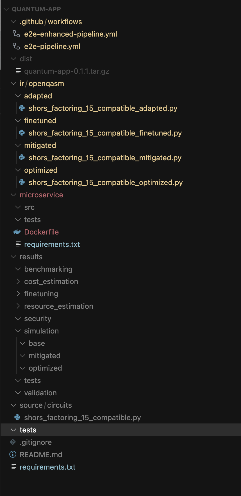

# TASK.md

## Quantum CLI SDK Implementation Tasks

### Phase 1: Core Command Implementation
1. [x] 2023-10-15: Set up project structure and CLI framework
2. [x] 2024-08-02: Implement `init` command for project scaffolding
   The scaffolding should follow structure as shown in below pic
   
3. [x] 2025-04-01: Create GitHub Actions workflow templates
   This template will basically be made available in the init generated scaffolding
4. [x] 2025-04-01: Implement `ir generate` command for OpenQASM conversion (Aligned with pipeline, LLM added)
5. [x] 2025-04-01: Implement `ir validate` command for IR verification (Aligned with pipeline)
6. [x] 2025-04-01: Implement `security scan` for vulnerability checking (Aligned with pipeline)
7. [x] 2025-04-01: Implement `run simulate` command with Qiskit backend (Aligned with pipeline, renamed --platform to --backend, added tests/docs)
8. [x] 2025-04-02: Add Cirq backend support to `run simulate` command (Note: QASM multi-bit measurement result aggregation needs improvement)
9. [x] 2024-07-29: Add Braket backend support to `run simulate` command
10. [x] 2023-11-30: Implement cross-platform compatibility testing (Added matrix strategy to e2e-pipeline.yml)

### Phase 2: Advanced Features
11. [x] 2024-09-04: Implement `ir optimize` command for circuit optimization (Aligned with pipeline, L0/L1 implemented, L2/L3 placeholders)
12. [x] 2024-09-04: Implement `ir mitigate` command for error mitigation (Aligned with pipeline, placeholders added)
13. [ ] 2023-12-18: Implement `test generate` command for test generation (Aligned with pipeline)  
Generate tests using llm such a way that it tests the generated ir code from every aspect w.r.t to quantum, Except or assume the mitigated ir file to be present at appropriate folder in the scaffolding, use the one we have 
14. [ ] 2023-12-25: Implement `test run` command for running circuit tests (Aligned with pipeline)
15. [ ] 2024-01-05: Implement `analyze resources` command for resource estimation (Aligned with pipeline)
16. [ ] 2024-01-12: Implement `analyze cost` command for cost estimation (Aligned with pipeline)
17. [ ] 2024-01-20: Implement `analyze benchmark` command for platform comparison (Aligned with pipeline)
18. [ ] 2024-01-30: Implement `ir finetune` command for hardware-specific optimization (Aligned with pipeline)
19. [ ] 2024-02-10: Create comprehensive benchmarking suite

### Phase 3: Deployment Capabilities
20. [ ] 2024-02-15: Implement `service generate` command for microservice generation (Aligned with pipeline)
21. [ ] 2024-02-25: Implement `service test-generate` command for microservice test generation (Aligned with pipeline)
22. [ ] 2024-03-05: Implement `service test-run` command for running microservice tests (Aligned with pipeline)
23. [ ] 2024-03-15: Implement `package create` command for application bundling (Aligned with pipeline)
24. [ ] 2024-03-25: Add Docker integration for microservice containerization
25. [ ] 2024-04-05: Implement versioning system for packages
26. [ ] 2024-04-15: Create deployment documentation

### Phase 4: Ecosystem Integration
27. [ ] 2024-04-25: Implement `hub publish` command for Hub Registry integration (Aligned with pipeline)
28. [ ] 2024-05-05: Add authentication system for Hub communication
29. [ ] 2024-05-15: Implement token management for hardware access
30. [ ] 2024-05-25: Create API wrappers for Hub communication
31. [ ] 2024-06-05: Implement user analytics for published applications
32. [ ] 2024-06-15: Add monitoring capabilities for deployed microservices
33. [ ] 2024-06-25: Implement subscription management integration

### Documentation and Testing
34. [ ] 2024-07-05: Create comprehensive CLI documentation
35. [ ] 2024-07-15: Write tutorials for common workflows
36. [ ] 2024-07-25: Create examples for different quantum platforms
37. [ ] 2024-08-05: Complete end-to-end testing suite
38. [ ] 2024-08-15: Implement automated CI/CD for the SDK itself
39. [ ] 2024-08-25: Create developer contribution guidelines
40. [ ] 2024-09-05: Prepare for beta release

### Release and Maintenance
41. [ ] 2024-09-15: Complete beta testing
42. [ ] 2024-09-25: Fix issues identified in beta
43. [ ] 2024-10-05: Prepare PyPI package release
44. [ ] 2024-10-15: Create release documentation
45. [ ] 2024-10-25: Publish version 1.0.0
46. [ ] 2024-11-05: Set up maintenance schedule
47. [ ] 2024-11-15: Plan future feature roadmap

## Completed Tasks
48. [x] 2023-10-10: Initial project planning
49. [x] 2023-10-12: Research existing quantum development frameworks

## Discovered During Work
<!-- Add new tasks discovered during development here -->
